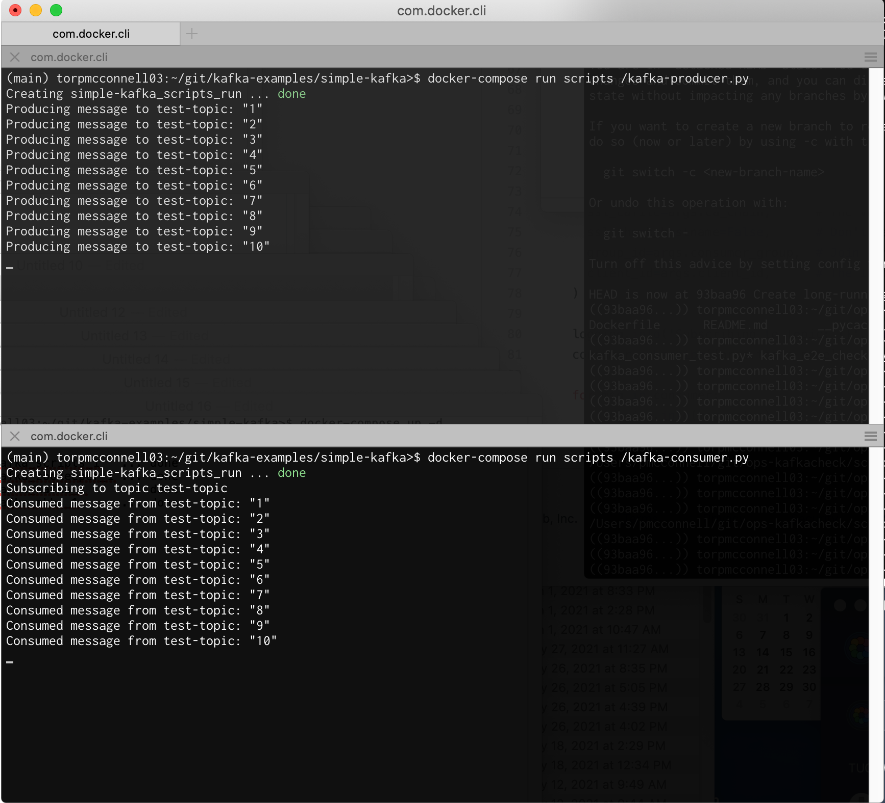

# Simple Kafka demo

This demo starts a single Kafka instance in Docker, and provides sample scripts to produce and consume messages. Within the docker-compose environment, the broker will be accessible at kafka:9092. An instance of AKHQ (a web UI for Kafka) will be available from the docker host (ie from your browser, if you're running docker-compose on your laptop) at [http://localhost:8080/](http://localhost:8080/).

### Bring up the environment

```
(main) torpmcconnell03:~/git/kafka-examples/simple-kafka>$ docker-compose up -d
Docker Compose is now in the Docker CLI, try `docker compose up`

Creating simple-kafka_scripts_1   ... done
Creating simple-kafka_zookeeper_1 ... done
Creating simple-kafka_kafka_1     ... done
Creating simple-kafka_akhq_1      ... done
```

### Run demo scripts

The demo includes a script to produce messages to a test topic, and another script to consume them. If you run both scripts in separate tabs, you'll see one script consuming messages as the other script produces them.

The script produces messages with a counter as the message value (ie 1, 2, 3, ...) to a topic called test-topic.

Start the consumer:
```
(main) torpmcconnell03:~/git/kafka-examples/simple-kafka>$ docker-compose run scripts /kafka-consumer.py
Creating simple-kafka_scripts_run ... done
Subscribing to topic test-topic
```

Start the producer:
```
(main) torpmcconnell03:~/git/kafka-examples/simple-kafka>$ docker-compose run scripts /kafka-producer.py
Creating simple-kafka_scripts_run ... done
Producing message to test-topic: "1"
Producing message to test-topic: "2"
Producing message to test-topic: "3"
[...]
```

As messages are produced to the test topic, you should see them being consumed by the consumer script:


If you stop the producer, the consumer will pause and keep polling for new messages. If you start the producer again, the consumer will go back to consuming messages.

### Kafka command line tools

You can exec into the Kafka broker container and run the Kafka command line tools.

Start a shell in the broker container:
```
(main) torpmcconnell03:~/git/kafka-examples/simple-kafka>$ docker-compose exec kafka bash
bash-4.4#
```

List topics (Note: test-topic was created when the demo scripts were run)
```
bash-4.4# kafka-topics.sh --bootstrap-server localhost:9092 --list
test-topic
bash-4.4#
```

Create a new topic
```
bash-4.4# kafka-topics.sh --bootstrap-server localhost:9092 --create --topic mytopic
bash-4.4# kafka-topics.sh --bootstrap-server localhost:9092 --list
mytopic
test-topic
bash-4.4#
```

Delete a topic
```
bash-4.4# kafka-topics.sh --bootstrap-server localhost:9092 --delete --topic test-topic
bash-4.4# kafka-topics.sh --bootstrap-server localhost:9092 --list
mytopic
bash-4.4#
```

### AKHQ / Kafka HQ

The docker-compose environment includes an instance of AKHQ, which you can reach at [http://localhost:8080/](http://localhost:8080/). This tool allows you to explore topics and data in Kafka via a web UI. It also has a "Live Tail" feature which will allow you to watch new messages as they are produced to a topic.
